``` r
library(tidyverse)
```

    ## ── Attaching packages ─────────────────────────────────────── tidyverse 1.3.1 ──

    ## ✔ ggplot2 3.3.5     ✔ purrr   0.3.4
    ## ✔ tibble  3.1.6     ✔ dplyr   1.0.7
    ## ✔ tidyr   1.1.4     ✔ stringr 1.4.0
    ## ✔ readr   2.1.1     ✔ forcats 0.5.1

    ## ── Conflicts ────────────────────────────────────────── tidyverse_conflicts() ──
    ## ✖ dplyr::filter() masks stats::filter()
    ## ✖ dplyr::lag()    masks stats::lag()

``` r
library(GGally)
```

    ## Registered S3 method overwritten by 'GGally':
    ##   method from   
    ##   +.gg   ggplot2

``` r
library(MASS)
```

    ## 
    ## Attaching package: 'MASS'

    ## The following object is masked from 'package:dplyr':
    ## 
    ##     select

``` r
library(caret)
```

    ## Loading required package: lattice

    ## 
    ## Attaching package: 'caret'

    ## The following object is masked from 'package:purrr':
    ## 
    ##     lift

``` r
library(glmnet)
```

    ## Loading required package: Matrix

    ## 
    ## Attaching package: 'Matrix'

    ## The following objects are masked from 'package:tidyr':
    ## 
    ##     expand, pack, unpack

    ## Loaded glmnet 4.1-4

``` r
library(kableExtra)
```

    ## 
    ## Attaching package: 'kableExtra'

    ## The following object is masked from 'package:dplyr':
    ## 
    ##     group_rows

## load data

will clean and remove opposing team stats, since they’re included as the
primary on the mirror matchup (i.e. Atl-Tor, vs Tor-Atl) also removing
date, since Game is a better metric of when a game takes place in
relation to the point of the season

### Variable Descriptions

-   PTS - Team Points Scored
-   FG - Field Goals Made
-   FGA - Field Goals Attempted
-   FG% - Field Goal Percentage
-   3P - Three Points Made
-   3PA - Three Points Attempted
-   3P% - Three Point Percentage
-   FT - Free Throws Made
-   FTA - Free Throws Attempted
-   FT% - Free Throw Percentage
-   ORB - Offensive Rebounds
-   TRB - Total Rebounds
-   AST - Assists
-   STL - Steals
-   BLK - Blocks
-   TOV - Turnovers
-   PF - Fouls

``` r
rawdata <- read.csv("https://raw.githubusercontent.com/boneeyah/GroupProject2/main/DataFile/nba.games.stats.csv")
cleandata <- rawdata[,c(7,3,5,8,10:25)] #rearrange to leave W/L first

str(cleandata) #check variable type
```

    ## 'data.frame':    9840 obs. of  20 variables:
    ##  $ WINorLOSS            : chr  "L" "W" "L" "L" ...
    ##  $ Game                 : int  1 2 3 4 5 6 7 8 9 10 ...
    ##  $ Home                 : chr  "Away" "Home" "Away" "Away" ...
    ##  $ TeamPoints           : int  102 102 92 119 103 91 100 114 94 109 ...
    ##  $ FieldGoals           : int  40 35 38 43 33 27 39 42 40 41 ...
    ##  $ FieldGoalsAttempted  : int  80 69 92 93 81 71 76 75 90 85 ...
    ##  $ FieldGoals.          : num  0.5 0.507 0.413 0.462 0.407 0.38 0.513 0.56 0.444 0.482 ...
    ##  $ X3PointShots         : int  13 7 8 13 9 10 9 11 3 9 ...
    ##  $ X3PointShotsAttempted: int  22 20 25 33 22 27 20 28 22 27 ...
    ##  $ X3PointShots.        : num  0.591 0.35 0.32 0.394 0.409 0.37 0.45 0.393 0.136 0.333 ...
    ##  $ FreeThrows           : int  9 25 8 20 28 27 13 19 11 18 ...
    ##  $ FreeThrowsAttempted  : int  17 33 11 26 36 28 18 23 13 23 ...
    ##  $ FreeThrows.          : num  0.529 0.758 0.727 0.769 0.778 0.964 0.722 0.826 0.846 0.783 ...
    ##  $ OffRebounds          : int  10 3 10 7 12 9 13 3 11 13 ...
    ##  $ TotalRebounds        : int  42 37 37 38 41 38 46 36 37 38 ...
    ##  $ Assists              : int  26 26 26 28 18 20 23 33 26 22 ...
    ##  $ Steals               : int  6 10 14 8 10 7 8 10 6 7 ...
    ##  $ Blocks               : int  8 6 5 3 5 3 4 5 8 3 ...
    ##  $ Turnovers            : int  17 12 13 19 8 15 18 13 18 10 ...
    ##  $ TotalFouls           : int  24 20 25 33 17 16 12 20 12 17 ...

``` r
cleandata %>% count(WINorLOSS) %>% ggplot(aes(x=WINorLOSS, y= n, fill = WINorLOSS))+geom_bar(stat = "identity") 
```

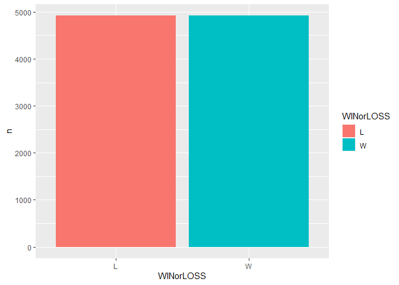

``` r
#data is perfectly balanced, becasue for each win on the data set there is an opposing team who lost and vice-versa

#set categorical variables to factors
cleandata$WINorLOSS <- as.factor(cleandata$WINorLOSS)
cleandata$Home <- as.factor(cleandata$Home)

##change variable names
cleandata <- rename(cleandata, c("PTS" = TeamPoints, "FG"=FieldGoals,"FGA"=FieldGoalsAttempted, "FG%"=FieldGoals., "3PA"=X3PointShotsAttempted, "3P" = X3PointShots, "3P%"=X3PointShots.,"FT"=FreeThrows, "FTA"=FreeThrowsAttempted, "FT%"=FreeThrows.,"ORB"=OffRebounds,"TRB"=TotalRebounds, "AST"=Assists, "STL"=Steals,"BLK"=Blocks,"TOV"=Turnovers, "PF"=TotalFouls))

sapply(cleandata, function(x) sum(is.na(x))) #no NAs present
```

    ## WINorLOSS      Game      Home       PTS        FG       FGA       FG%        3P 
    ##         0         0         0         0         0         0         0         0 
    ##       3PA       3P%        FT       FTA       FT%       ORB       TRB       AST 
    ##         0         0         0         0         0         0         0         0 
    ##       STL       BLK       TOV        PF 
    ##         0         0         0         0

``` r
ggpairs(cleandata, columns = 2:10, aes(color = WINorLOSS))
```

    ## `stat_bin()` using `bins = 30`. Pick better value with `binwidth`.
    ## `stat_bin()` using `bins = 30`. Pick better value with `binwidth`.
    ## `stat_bin()` using `bins = 30`. Pick better value with `binwidth`.
    ## `stat_bin()` using `bins = 30`. Pick better value with `binwidth`.
    ## `stat_bin()` using `bins = 30`. Pick better value with `binwidth`.
    ## `stat_bin()` using `bins = 30`. Pick better value with `binwidth`.
    ## `stat_bin()` using `bins = 30`. Pick better value with `binwidth`.
    ## `stat_bin()` using `bins = 30`. Pick better value with `binwidth`.

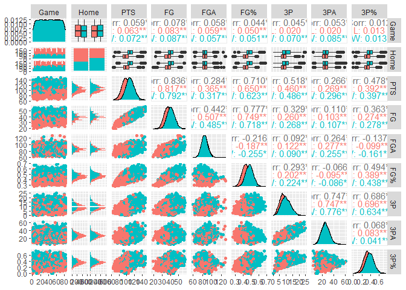

``` r
ggpairs(cleandata, columns = 11:20, aes(color = WINorLOSS))
```

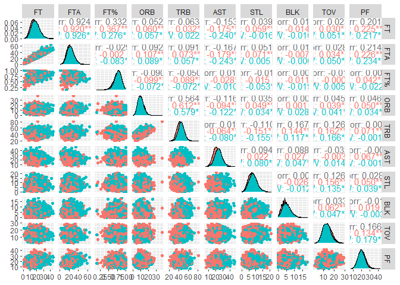 There
is a separation between home and away also for team points, field goals,
field goal %, 3 point shots and 3 point shot % to a lesser extent, total
rebounds, assists, and turnovers

``` r
plot(WINorLOSS~Home, col = c("#F8766D","#00bfc4"), data = cleandata)
```

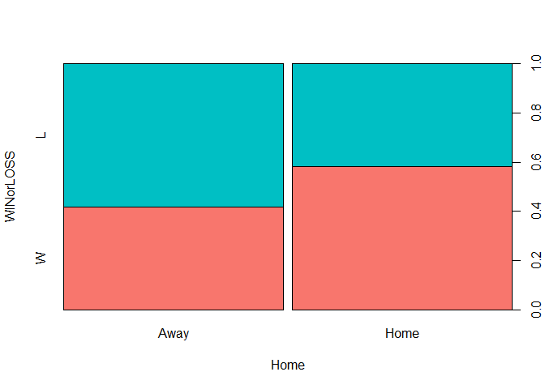

``` r
plot(PTS~WINorLOSS, col = c("#F8766D","#00bfc4"), data = cleandata)
```

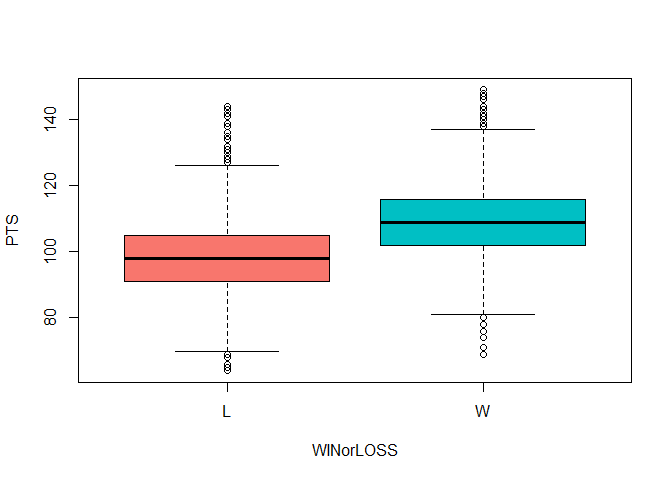

``` r
plot(`FG%`~WINorLOSS, col = c("#F8766D","#00bfc4"), data = cleandata)
```

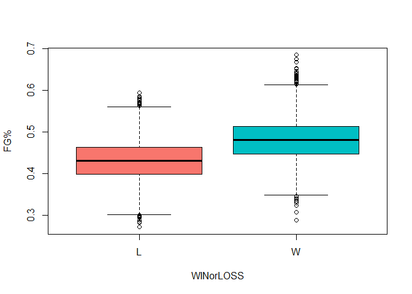

``` r
plot(FG~WINorLOSS, col = c("#F8766D","#00bfc4"), data = cleandata)
```

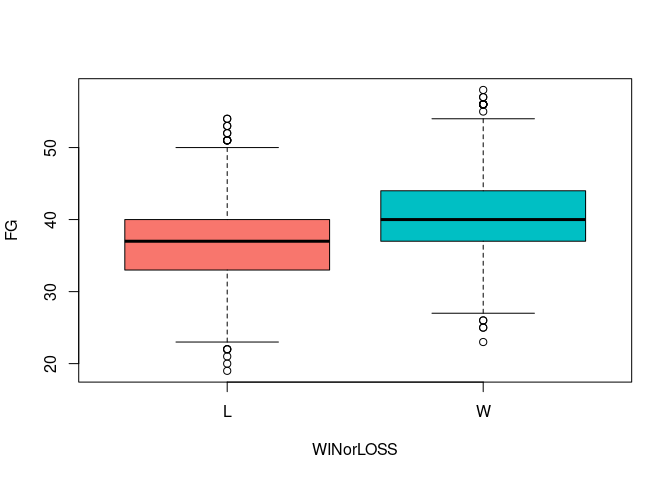

``` r
plot(`3PA`~WINorLOSS, col = c("#F8766D","#00bfc4"), data = cleandata)
```

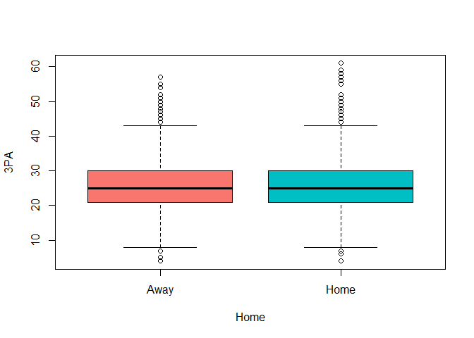

``` r
plot(`3P%`~WINorLOSS, col = c("#F8766D","#00bfc4"), data = cleandata)
```

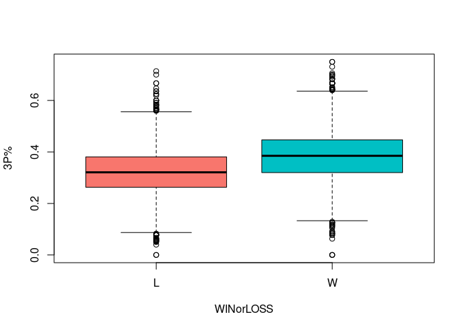

``` r
plot(TRB~WINorLOSS, col = c("#F8766D","#00bfc4"), data = cleandata)
```

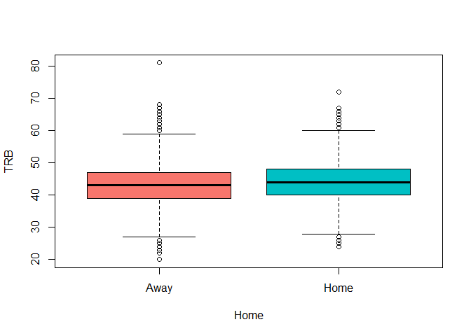

``` r
plot(AST~WINorLOSS, col = c("#F8766D","#00bfc4"), data = cleandata)
```

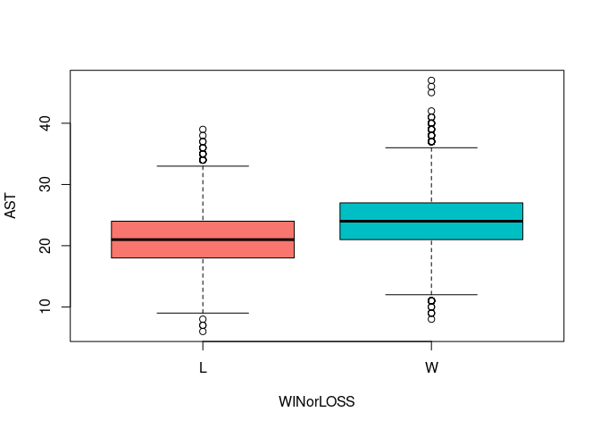
##correlation plot build a heatmap to check for correlation between
explanatory variables

``` r
library(lattice)
library(reshape2)
```

    ## 
    ## Attaching package: 'reshape2'

    ## The following object is masked from 'package:tidyr':
    ## 
    ##     smiths

``` r
library(ggthemes)
cleandata.corr <- round(cor(cleandata[,c(2,4:20)]),2)
cleandata.corr <- melt(cleandata.corr)

cleandata.corr %>% ggplot(aes(x=Var1, y=Var2, fill=value))+geom_tile()+scale_fill_viridis_c()+theme(axis.title.x = element_blank(),axis.title.y = element_blank())
```

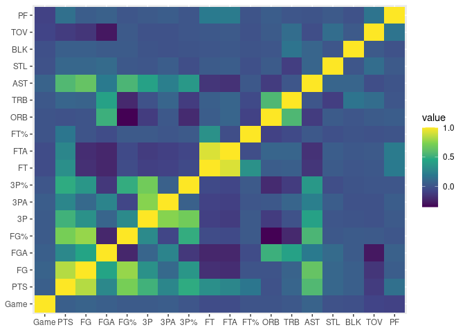

``` r
#set seed
set.seed(1726)#8721
##80-20 split of data
index <- sample(nrow(cleandata), round(.8*nrow(cleandata)))
train <- cleandata[index,]
test <- cleandata[-index,]


simple.mod <- glm(WINorLOSS~ Home + PTS + `FG%` + TRB, family = "binomial", data=train)
coef(simple.mod)
```

    ##  (Intercept)     HomeHome          PTS        `FG%`          TRB 
    ## -21.58434006   0.52997432   0.03180096  24.49187691   0.15724328

``` r
summary(simple.mod)
```

    ## 
    ## Call:
    ## glm(formula = WINorLOSS ~ Home + PTS + `FG%` + TRB, family = "binomial", 
    ##     data = train)
    ## 
    ## Deviance Residuals: 
    ##     Min       1Q   Median       3Q      Max  
    ## -3.0782  -0.7748  -0.1478   0.7786   2.8805  
    ## 
    ## Coefficients:
    ##               Estimate Std. Error z value Pr(>|z|)    
    ## (Intercept) -21.584340   0.510053 -42.318   <2e-16 ***
    ## HomeHome      0.529974   0.056683   9.350   <2e-16 ***
    ## PTS           0.031801   0.003536   8.995   <2e-16 ***
    ## `FG%`        24.491877   0.906396  27.021   <2e-16 ***
    ## TRB           0.157243   0.005563  28.265   <2e-16 ***
    ## ---
    ## Signif. codes:  0 '***' 0.001 '**' 0.01 '*' 0.05 '.' 0.1 ' ' 1
    ## 
    ## (Dispersion parameter for binomial family taken to be 1)
    ## 
    ##     Null deviance: 10911.5  on 7871  degrees of freedom
    ## Residual deviance:  7568.2  on 7867  degrees of freedom
    ## AIC: 7578.2
    ## 
    ## Number of Fisher Scoring iterations: 5

``` r
simple.pred <- predict(simple.mod, newdata = test, type = "response")
simple.pred <- ifelse(simple.pred > .5, "W", "L")
simple.pred <- factor(simple.pred, levels = c("W","L"))
test$WINorLOSS <- factor(test$WINorLOSS, levels = c("W", "L"))


cm.simple <- confusionMatrix(data =simple.pred, reference = test$WINorLOSS)
```

now adding feature selection to see if the model can improve with the
table in it’s present format

``` r
full.mod <- glm(WINorLOSS~.,family = "binomial", data=cleandata)
step.mod <- full.mod %>% stepAIC(trace = FALSE)
summary(step.mod)
```

    ## 
    ## Call:
    ## glm(formula = WINorLOSS ~ Game + Home + PTS + FGA + `FG%` + `3P%` + 
    ##     FTA + `FT%` + TRB + AST + STL + BLK + TOV + PF, family = "binomial", 
    ##     data = cleandata)
    ## 
    ## Deviance Residuals: 
    ##     Min       1Q   Median       3Q      Max  
    ## -3.0387  -0.4800  -0.0019   0.4511   3.3286  
    ## 
    ## Coefficients:
    ##               Estimate Std. Error z value Pr(>|z|)    
    ## (Intercept) -10.136481   1.312057  -7.726 1.11e-14 ***
    ## Game         -0.009358   0.001336  -7.005 2.46e-12 ***
    ## HomeHome      0.376439   0.062333   6.039 1.55e-09 ***
    ## PTS           0.128024   0.011902  10.757  < 2e-16 ***
    ## FGA          -0.282979   0.013809 -20.493  < 2e-16 ***
    ## `FG%`        13.032984   2.012702   6.475 9.46e-11 ***
    ## `3P%`         2.735630   0.478129   5.722 1.06e-08 ***
    ## FTA          -0.070524   0.010077  -6.998 2.59e-12 ***
    ## `FT%`         1.951904   0.390061   5.004 5.61e-07 ***
    ## TRB           0.367789   0.008985  40.934  < 2e-16 ***
    ## AST           0.027277   0.008306   3.284  0.00102 ** 
    ## STL           0.398507   0.013329  29.898  < 2e-16 ***
    ## BLK           0.122687   0.012678   9.677  < 2e-16 ***
    ## TOV          -0.341337   0.011094 -30.767  < 2e-16 ***
    ## PF           -0.064846   0.007870  -8.240  < 2e-16 ***
    ## ---
    ## Signif. codes:  0 '***' 0.001 '**' 0.01 '*' 0.05 '.' 0.1 ' ' 1
    ## 
    ## (Dispersion parameter for binomial family taken to be 1)
    ## 
    ##     Null deviance: 13641.1  on 9839  degrees of freedom
    ## Residual deviance:  6647.9  on 9825  degrees of freedom
    ## AIC: 6677.9
    ## 
    ## Number of Fisher Scoring iterations: 6

``` r
step.pred <- predict(step.mod, newdata = test, type = "response")
step.pred <- ifelse(step.pred>.5, "W", "L")
step.pred <- factor(step.pred, levels = c("W","L"))

cm.step <- confusionMatrix(data = step.pred, reference = test$WINorLOSS)
cm.step
```

    ## Confusion Matrix and Statistics
    ## 
    ##           Reference
    ## Prediction   W   L
    ##          W 881 139
    ##          L 155 793
    ##                                           
    ##                Accuracy : 0.8506          
    ##                  95% CI : (0.8341, 0.8661)
    ##     No Information Rate : 0.5264          
    ##     P-Value [Acc > NIR] : <2e-16          
    ##                                           
    ##                   Kappa : 0.7006          
    ##                                           
    ##  Mcnemar's Test P-Value : 0.3817          
    ##                                           
    ##             Sensitivity : 0.8504          
    ##             Specificity : 0.8509          
    ##          Pos Pred Value : 0.8637          
    ##          Neg Pred Value : 0.8365          
    ##              Prevalence : 0.5264          
    ##          Detection Rate : 0.4477          
    ##    Detection Prevalence : 0.5183          
    ##       Balanced Accuracy : 0.8506          
    ##                                           
    ##        'Positive' Class : W               
    ## 

The variable Game, probably does not make sense in the context of our
dataset without an interaction. Since for any given game there are
exactly the same number of wins and losses (each match has one winner
and one loser). We will therefore fit a new model without Game for our
no interaction model, keeping in mind that there might be potential
interactions between Game and other variables which might make for a
better more complex model in Objective 2

``` r
reduced.mod <- glm(WINorLOSS~ Home + PTS + FGA + `FG%` + `3P%` + FTA + `FT%` + TRB + AST + STL + BLK + TOV + PF, family = "binomial", data = train)
summary(reduced.mod)
```

    ## 
    ## Call:
    ## glm(formula = WINorLOSS ~ Home + PTS + FGA + `FG%` + `3P%` + 
    ##     FTA + `FT%` + TRB + AST + STL + BLK + TOV + PF, family = "binomial", 
    ##     data = train)
    ## 
    ## Deviance Residuals: 
    ##     Min       1Q   Median       3Q      Max  
    ## -2.9624  -0.4919  -0.0344   0.4492   3.3016  
    ## 
    ## Coefficients:
    ##               Estimate Std. Error z value Pr(>|z|)    
    ## (Intercept) -11.693728   1.467159  -7.970 1.58e-15 ***
    ## HomeHome      0.444503   0.069541   6.392 1.64e-10 ***
    ## PTS           0.116255   0.013254   8.771  < 2e-16 ***
    ## FGA          -0.266739   0.015267 -17.472  < 2e-16 ***
    ## `FG%`        14.578815   2.246414   6.490 8.59e-11 ***
    ## `3P%`         3.389475   0.539014   6.288 3.21e-10 ***
    ## FTA          -0.061500   0.011246  -5.469 4.53e-08 ***
    ## `FT%`         2.040862   0.440041   4.638 3.52e-06 ***
    ## TRB           0.356585   0.009847  36.213  < 2e-16 ***
    ## AST           0.030257   0.009174   3.298 0.000973 ***
    ## STL           0.392792   0.014793  26.552  < 2e-16 ***
    ## BLK           0.126235   0.014095   8.956  < 2e-16 ***
    ## TOV          -0.331862   0.012265 -27.058  < 2e-16 ***
    ## PF           -0.061544   0.008687  -7.085 1.39e-12 ***
    ## ---
    ## Signif. codes:  0 '***' 0.001 '**' 0.01 '*' 0.05 '.' 0.1 ' ' 1
    ## 
    ## (Dispersion parameter for binomial family taken to be 1)
    ## 
    ##     Null deviance: 10911.5  on 7871  degrees of freedom
    ## Residual deviance:  5346.1  on 7858  degrees of freedom
    ## AIC: 5374.1
    ## 
    ## Number of Fisher Scoring iterations: 6

``` r
reduced.pred <- predict(reduced.mod, newdata = test, type = "response")
reduced.pred <- ifelse(reduced.pred>.5, "W", "L")
reduced.pred <- factor(reduced.pred, levels = c("W","L"))

cm.reduced <- confusionMatrix(reduced.pred, test$WINorLOSS)
cm.reduced
```

    ## Confusion Matrix and Statistics
    ## 
    ##           Reference
    ## Prediction   W   L
    ##          W 871 148
    ##          L 165 784
    ##                                          
    ##                Accuracy : 0.841          
    ##                  95% CI : (0.824, 0.8569)
    ##     No Information Rate : 0.5264         
    ##     P-Value [Acc > NIR] : <2e-16         
    ##                                          
    ##                   Kappa : 0.6813         
    ##                                          
    ##  Mcnemar's Test P-Value : 0.3658         
    ##                                          
    ##             Sensitivity : 0.8407         
    ##             Specificity : 0.8412         
    ##          Pos Pred Value : 0.8548         
    ##          Neg Pred Value : 0.8261         
    ##              Prevalence : 0.5264         
    ##          Detection Rate : 0.4426         
    ##    Detection Prevalence : 0.5178         
    ##       Balanced Accuracy : 0.8410         
    ##                                          
    ##        'Positive' Class : W              
    ## 

Finally, we will now use LASSO for selection to compare to the simple

``` r
train.x <- model.matrix(WINorLOSS~.-1, data = train) #-1 removes intercept column
train.y <- train[,1]

cvfit <- cv.glmnet(train.x, train.y, family = "binomial", type.measure = "class")
plot(cvfit)
```

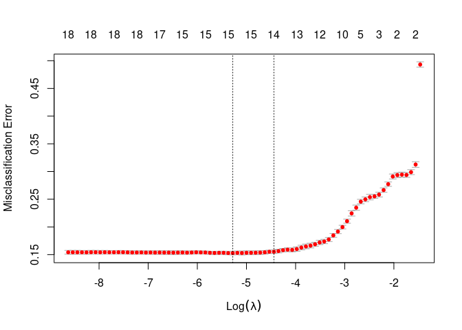

``` r
coef(cvfit, s= "lambda.min")
```

    ## 21 x 1 sparse Matrix of class "dgCMatrix"
    ##                        s1
    ## (Intercept) -16.301389052
    ## Game         -0.005224757
    ## HomeAway     -0.343760854
    ## HomeHome      .          
    ## PTS           0.035849593
    ## FG            .          
    ## FGA          -0.153333651
    ## `FG%`        23.802502986
    ## `3P`          0.055823485
    ## `3PA`         .          
    ## `3P%`         3.033173725
    ## FT            .          
    ## FTA           .          
    ## `FT%`         2.805172846
    ## ORB          -0.006124029
    ## TRB           0.294478444
    ## AST           0.021556644
    ## STL           0.315629994
    ## BLK           0.100229225
    ## TOV          -0.265936042
    ## PF           -0.055145272

``` r
cvfit$lambda.min # this is the optimal LASSO penalty value
```

    ## [1] 0.005099009

``` r
lasso.mod <- glmnet(train.x, train.y, family = "binomial", lambda = cvfit$lambda.min)
summary(lasso.mod)
```

    ##            Length Class     Mode     
    ## a0          1     -none-    numeric  
    ## beta       20     dgCMatrix S4       
    ## df          1     -none-    numeric  
    ## dim         2     -none-    numeric  
    ## lambda      1     -none-    numeric  
    ## dev.ratio   1     -none-    numeric  
    ## nulldev     1     -none-    numeric  
    ## npasses     1     -none-    numeric  
    ## jerr        1     -none-    numeric  
    ## offset      1     -none-    logical  
    ## classnames  2     -none-    character
    ## call        5     -none-    call     
    ## nobs        1     -none-    numeric

``` r
print(lasso.mod)
```

    ## 
    ## Call:  glmnet(x = train.x, y = train.y, family = "binomial", lambda = cvfit$lambda.min) 
    ## 
    ##   Df %Dev   Lambda
    ## 1 15 50.6 0.005099

``` r
test.x <- model.matrix(WINorLOSS~.-1, data = test)
lasso.pred <- predict(lasso.mod, newx = test.x, type = "response")
lasso.pred <- ifelse(lasso.pred>.5, "W", "L")
lasso.pred <- factor(lasso.pred, levels = c("W","L"))

cm.lasso <- confusionMatrix(data = lasso.pred, reference = test$WINorLOSS)
cm.lasso
```

    ## Confusion Matrix and Statistics
    ## 
    ##           Reference
    ## Prediction   W   L
    ##          W 875 137
    ##          L 161 795
    ##                                          
    ##                Accuracy : 0.8486         
    ##                  95% CI : (0.832, 0.8641)
    ##     No Information Rate : 0.5264         
    ##     P-Value [Acc > NIR] : <2e-16         
    ##                                          
    ##                   Kappa : 0.6967         
    ##                                          
    ##  Mcnemar's Test P-Value : 0.1827         
    ##                                          
    ##             Sensitivity : 0.8446         
    ##             Specificity : 0.8530         
    ##          Pos Pred Value : 0.8646         
    ##          Neg Pred Value : 0.8316         
    ##              Prevalence : 0.5264         
    ##          Detection Rate : 0.4446         
    ##    Detection Prevalence : 0.5142         
    ##       Balanced Accuracy : 0.8488         
    ##                                          
    ##        'Positive' Class : W              
    ## 

Create a table with the results from all the confusion Matrix models

``` r
cm.df <- data.frame("Model" = c("Simple", "Stepwise", "Reduced", "LASSO"),
           "Accuracy"= c(cm.simple$overall[1], cm.step$overall[1], cm.reduced$overall[1],cm.lasso$overall[1]),
           "Sensitivity"=c(cm.simple$byClass[1], cm.step$byClass[1],cm.reduced$byClass[1], cm.lasso$byClass[1]),
           "Specificty" = c(cm.simple$byClass[2], cm.step$byClass[2], cm.reduced$byClass[2], cm.lasso$byClass[2]))
cm.df <- kable(cm.df, format = "html") %>% kable_styling(latex_options = c("striped", "scale_down"), full_width = FALSE) %>% 
  row_spec(row = 0, italic = T, background = "#21918c", color = "white") %>% 
  column_spec(1:2, width = "0.5in")
cm.df
```

<table class="table" style="width: auto !important; margin-left: auto; margin-right: auto;">
<thead>
<tr>
<th style="text-align:left;font-style: italic;color: white !important;background-color: #21918c !important;">
Model
</th>
<th style="text-align:right;font-style: italic;color: white !important;background-color: #21918c !important;">
Accuracy
</th>
<th style="text-align:right;font-style: italic;color: white !important;background-color: #21918c !important;">
Sensitivity
</th>
<th style="text-align:right;font-style: italic;color: white !important;background-color: #21918c !important;">
Specificty
</th>
</tr>
</thead>
<tbody>
<tr>
<td style="text-align:left;width: 0.5in; ">
Simple
</td>
<td style="text-align:right;width: 0.5in; ">
0.7677846
</td>
<td style="text-align:right;">
0.7586873
</td>
<td style="text-align:right;">
0.7778970
</td>
</tr>
<tr>
<td style="text-align:left;width: 0.5in; ">
Stepwise
</td>
<td style="text-align:right;width: 0.5in; ">
0.8506098
</td>
<td style="text-align:right;">
0.8503861
</td>
<td style="text-align:right;">
0.8508584
</td>
</tr>
<tr>
<td style="text-align:left;width: 0.5in; ">
Reduced
</td>
<td style="text-align:right;width: 0.5in; ">
0.8409553
</td>
<td style="text-align:right;">
0.8407336
</td>
<td style="text-align:right;">
0.8412017
</td>
</tr>
<tr>
<td style="text-align:left;width: 0.5in; ">
LASSO
</td>
<td style="text-align:right;width: 0.5in; ">
0.8485772
</td>
<td style="text-align:right;">
0.8445946
</td>
<td style="text-align:right;">
0.8530043
</td>
</tr>
</tbody>
</table>
