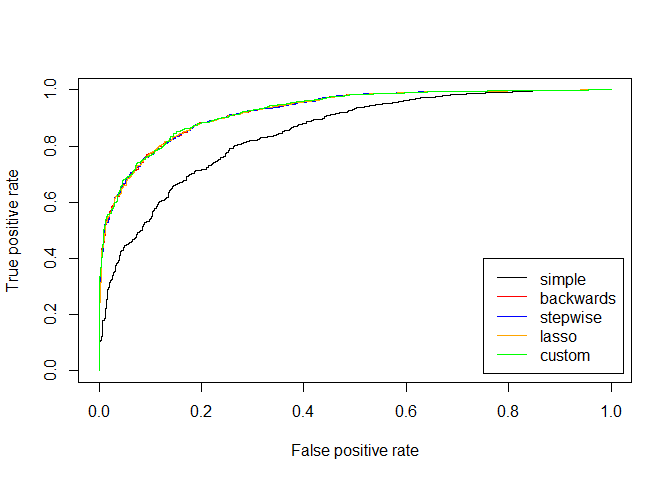

``` r
library(tidyverse)
```

    ## -- Attaching packages --------------------------------------- tidyverse 1.3.1 --

    ## v ggplot2 3.3.5     v purrr   0.3.4
    ## v tibble  3.1.6     v dplyr   1.0.8
    ## v tidyr   1.2.0     v stringr 1.4.0
    ## v readr   2.1.2     v forcats 0.5.1

    ## -- Conflicts ------------------------------------------ tidyverse_conflicts() --
    ## x dplyr::filter() masks stats::filter()
    ## x dplyr::lag()    masks stats::lag()

``` r
library(GGally)
```

    ## Registered S3 method overwritten by 'GGally':
    ##   method from   
    ##   +.gg   ggplot2

``` r
library(MASS)
```

    ## 
    ## Attaching package: 'MASS'

    ## The following object is masked from 'package:dplyr':
    ## 
    ##     select

``` r
library(caret)
```

    ## Warning: package 'caret' was built under R version 4.1.3

    ## Loading required package: lattice

    ## 
    ## Attaching package: 'caret'

    ## The following object is masked from 'package:purrr':
    ## 
    ##     lift

``` r
library(glmnet)
```

    ## Warning: package 'glmnet' was built under R version 4.1.3

    ## Loading required package: Matrix

    ## 
    ## Attaching package: 'Matrix'

    ## The following objects are masked from 'package:tidyr':
    ## 
    ##     expand, pack, unpack

    ## Loaded glmnet 4.1-4

``` r
library(kableExtra)
```

    ## 
    ## Attaching package: 'kableExtra'

    ## The following object is masked from 'package:dplyr':
    ## 
    ##     group_rows

``` r
library(DescTools)
```

    ## 
    ## Attaching package: 'DescTools'

    ## The following objects are masked from 'package:caret':
    ## 
    ##     MAE, RMSE

``` r
library(epitools)
```

## load data

will clean and remove opposing team stats, since they’re included as the
primary on the mirror matchup (i.e. Atl-Tor, vs Tor-Atl) also removing
date, since Game is a better metric of when a game takes place in
relation to the point of the season

### Variable Descriptions

-   PTS - Team Points Scored
-   FG - Field Goals Made
-   FGA - Field Goals Attempted
-   FG% - Field Goal Percentage
-   3P - Three Points Made
-   3PA - Three Points Attempted
-   3P% - Three Point Percentage
-   FT - Free Throws Made
-   FTA - Free Throws Attempted
-   FT% - Free Throw Percentage
-   ORB - Offensive Rebounds
-   TRB - Total Rebounds
-   AST - Assists
-   STL - Steals
-   BLK - Blocks
-   TOV - Turnovers
-   PF - Fouls

``` r
rawdata <- read.csv("https://raw.githubusercontent.com/boneeyah/GroupProject2/main/DataFile/nba.games.stats.csv")
cleandata <- rawdata[,c(7,3,5,8,10:25)] #rearrange to leave W/L first

str(cleandata) #check variable type
```

    ## 'data.frame':    9840 obs. of  20 variables:
    ##  $ WINorLOSS            : chr  "L" "W" "L" "L" ...
    ##  $ Game                 : int  1 2 3 4 5 6 7 8 9 10 ...
    ##  $ Home                 : chr  "Away" "Home" "Away" "Away" ...
    ##  $ TeamPoints           : int  102 102 92 119 103 91 100 114 94 109 ...
    ##  $ FieldGoals           : int  40 35 38 43 33 27 39 42 40 41 ...
    ##  $ FieldGoalsAttempted  : int  80 69 92 93 81 71 76 75 90 85 ...
    ##  $ FieldGoals.          : num  0.5 0.507 0.413 0.462 0.407 0.38 0.513 0.56 0.444 0.482 ...
    ##  $ X3PointShots         : int  13 7 8 13 9 10 9 11 3 9 ...
    ##  $ X3PointShotsAttempted: int  22 20 25 33 22 27 20 28 22 27 ...
    ##  $ X3PointShots.        : num  0.591 0.35 0.32 0.394 0.409 0.37 0.45 0.393 0.136 0.333 ...
    ##  $ FreeThrows           : int  9 25 8 20 28 27 13 19 11 18 ...
    ##  $ FreeThrowsAttempted  : int  17 33 11 26 36 28 18 23 13 23 ...
    ##  $ FreeThrows.          : num  0.529 0.758 0.727 0.769 0.778 0.964 0.722 0.826 0.846 0.783 ...
    ##  $ OffRebounds          : int  10 3 10 7 12 9 13 3 11 13 ...
    ##  $ TotalRebounds        : int  42 37 37 38 41 38 46 36 37 38 ...
    ##  $ Assists              : int  26 26 26 28 18 20 23 33 26 22 ...
    ##  $ Steals               : int  6 10 14 8 10 7 8 10 6 7 ...
    ##  $ Blocks               : int  8 6 5 3 5 3 4 5 8 3 ...
    ##  $ Turnovers            : int  17 12 13 19 8 15 18 13 18 10 ...
    ##  $ TotalFouls           : int  24 20 25 33 17 16 12 20 12 17 ...

``` r
cleandata %>% count(WINorLOSS) %>% ggplot(aes(x=WINorLOSS, y= n, fill = WINorLOSS))+geom_bar(stat = "identity") 
```


``` r
#data is perfectly balanced, becasue for each win on the data set there is an opposing team who lost and vice-versa

#set categorical variables to factors
cleandata$WINorLOSS <- as.factor(cleandata$WINorLOSS)
cleandata$Home <- as.factor(cleandata$Home)

##change variable names
cleandata <- rename(cleandata, c("PTS" = TeamPoints, "FG"=FieldGoals,"FGA"=FieldGoalsAttempted, "FG%"=FieldGoals., "3PA"=X3PointShotsAttempted, "3P" = X3PointShots, "3P%"=X3PointShots.,"FT"=FreeThrows, "FTA"=FreeThrowsAttempted, "FT%"=FreeThrows.,"ORB"=OffRebounds,"TRB"=TotalRebounds, "AST"=Assists, "STL"=Steals,"BLK"=Blocks,"TOV"=Turnovers, "PF"=TotalFouls))

sapply(cleandata, function(x) sum(is.na(x))) #no NAs present
```

    ## WINorLOSS      Game      Home       PTS        FG       FGA       FG%        3P 
    ##         0         0         0         0         0         0         0         0 
    ##       3PA       3P%        FT       FTA       FT%       ORB       TRB       AST 
    ##         0         0         0         0         0         0         0         0 
    ##       STL       BLK       TOV        PF 
    ##         0         0         0         0

``` r
ggpairs(cleandata, columns = 2:10, aes(color = WINorLOSS))
```

    ## `stat_bin()` using `bins = 30`. Pick better value with `binwidth`.
    ## `stat_bin()` using `bins = 30`. Pick better value with `binwidth`.
    ## `stat_bin()` using `bins = 30`. Pick better value with `binwidth`.
    ## `stat_bin()` using `bins = 30`. Pick better value with `binwidth`.
    ## `stat_bin()` using `bins = 30`. Pick better value with `binwidth`.
    ## `stat_bin()` using `bins = 30`. Pick better value with `binwidth`.
    ## `stat_bin()` using `bins = 30`. Pick better value with `binwidth`.
    ## `stat_bin()` using `bins = 30`. Pick better value with `binwidth`.


``` r
ggpairs(cleandata, columns = 11:20, aes(color = WINorLOSS))
```

 There
is a separation between home and away also for team points, field goals,
field goal %, 3 point shots and 3 point shot % to a lesser extent, total
rebounds, assists, and turnovers

``` r
plot(WINorLOSS~Home, col = c("#F8766D","#00bfc4"), data = cleandata)
```


``` r
plot(PTS~WINorLOSS, col = c("#F8766D","#00bfc4"), data = cleandata)
```


``` r
plot(`FG%`~WINorLOSS, col = c("#F8766D","#00bfc4"), data = cleandata)
```


``` r
plot(FG~WINorLOSS, col = c("#F8766D","#00bfc4"), data = cleandata)
```


``` r
plot(`3PA`~WINorLOSS, col = c("#F8766D","#00bfc4"), data = cleandata)
```


``` r
plot(`3P%`~WINorLOSS, col = c("#F8766D","#00bfc4"), data = cleandata)
```


``` r
plot(TRB~WINorLOSS, col = c("#F8766D","#00bfc4"), data = cleandata)
```


``` r
plot(AST~WINorLOSS, col = c("#F8766D","#00bfc4"), data = cleandata)
```


##correlation plot build a heatmap to check for correlation between
explanatory variables

``` r
library(lattice)
library(reshape2)
```

    ## 
    ## Attaching package: 'reshape2'

    ## The following object is masked from 'package:tidyr':
    ## 
    ##     smiths

``` r
library(ggthemes)
cleandata.corr <- round(cor(cleandata[,c(2,4:20)]),2)
cleandata.corr <- melt(cleandata.corr)

cleandata.corr %>% ggplot(aes(x=Var1, y=Var2, fill=value))+geom_tile()+scale_fill_viridis_c()+theme(axis.title.x = element_blank(),axis.title.y = element_blank())
```

 Not
surprisingly, points and field goals, free throw attempts and free
throws seem to have a strong correlation

``` r
#set seed
set.seed(1776)
##80-20 split of data
index <- sample(nrow(cleandata), round(.8*nrow(cleandata)))
train <- cleandata[index,]
test <- cleandata[-index,]


simple.mod <- glm(WINorLOSS~ Home + PTS + `FG%` + TRB, family = "binomial", data=train)
coef(simple.mod)
```

    ##  (Intercept)     HomeHome          PTS        `FG%`          TRB 
    ## -21.45158977   0.48070279   0.02676465  24.98143539   0.16190756

``` r
summary(simple.mod)
```

    ## 
    ## Call:
    ## glm(formula = WINorLOSS ~ Home + PTS + `FG%` + TRB, family = "binomial", 
    ##     data = train)
    ## 
    ## Deviance Residuals: 
    ##     Min       1Q   Median       3Q      Max  
    ## -3.0647  -0.7751  -0.1305   0.7730   2.8623  
    ## 
    ## Coefficients:
    ##               Estimate Std. Error z value Pr(>|z|)    
    ## (Intercept) -21.451590   0.506465 -42.356  < 2e-16 ***
    ## HomeHome      0.480703   0.056508   8.507  < 2e-16 ***
    ## PTS           0.026765   0.003542   7.555 4.18e-14 ***
    ## `FG%`        24.981435   0.914605  27.314  < 2e-16 ***
    ## TRB           0.161908   0.005588  28.973  < 2e-16 ***
    ## ---
    ## Signif. codes:  0 '***' 0.001 '**' 0.01 '*' 0.05 '.' 0.1 ' ' 1
    ## 
    ## (Dispersion parameter for binomial family taken to be 1)
    ## 
    ##     Null deviance: 10912.4  on 7871  degrees of freedom
    ## Residual deviance:  7605.2  on 7867  degrees of freedom
    ## AIC: 7615.2
    ## 
    ## Number of Fisher Scoring iterations: 5

``` r
simple.pred <- predict(simple.mod, newdata = test, type = "response")
simple.pred <- ifelse(simple.pred > .5, "W", "L")
simple.pred <- factor(simple.pred, levels = c("W","L"))
test$WINorLOSS <- factor(test$WINorLOSS, levels = c("W", "L"))


cm.simple <- confusionMatrix(data =simple.pred, reference = test$WINorLOSS)
```

now adding feature selection to see if the model can improve with the
table in it’s present format

``` r
empty.mod <- glm(WINorLOSS~ 1,family = "binomial", data = train) #as a starting point for forward and stepwise selection
full.mod <- glm(WINorLOSS~.,family = "binomial", data=train) #starting point for backward selection
step.mod <- empty.mod %>% stepAIC(direction = "both", scope = list(lower = empty.mod, upper=~Game + Home + PTS + FG + FGA + `FG%` + `3P` + `3PA` + `3P%` + FT + FTA + `FT%` + ORB + TRB + AST + STL + BLK + TOV + PF),trace = FALSE)
summary(step.mod)
```

    ## 
    ## Call:
    ## glm(formula = WINorLOSS ~ PTS + TRB + FGA + TOV + STL + FTA + 
    ##     BLK + PF + Game + `3PA` + Home + AST + ORB + `3P%`, family = "binomial", 
    ##     data = train)
    ## 
    ## Deviance Residuals: 
    ##      Min        1Q    Median        3Q       Max  
    ## -3.07590  -0.48427  -0.02445   0.44542   3.06466  
    ## 
    ## Coefficients:
    ##              Estimate Std. Error z value Pr(>|z|)    
    ## (Intercept) -2.661812   0.604763  -4.401 1.08e-05 ***
    ## PTS          0.203528   0.006414  31.730  < 2e-16 ***
    ## TRB          0.377689   0.010541  35.829  < 2e-16 ***
    ## FGA         -0.343628   0.010646 -32.277  < 2e-16 ***
    ## TOV         -0.339821   0.012482 -27.226  < 2e-16 ***
    ## STL          0.405092   0.015062  26.896  < 2e-16 ***
    ## FTA         -0.129470   0.007067 -18.320  < 2e-16 ***
    ## BLK          0.120771   0.014180   8.517  < 2e-16 ***
    ## PF          -0.066161   0.008873  -7.457 8.88e-14 ***
    ## Game        -0.010751   0.001507  -7.133 9.85e-13 ***
    ## `3PA`       -0.034333   0.005296  -6.483 8.98e-11 ***
    ## HomeHome     0.398512   0.069914   5.700 1.20e-08 ***
    ## AST          0.027332   0.009200   2.971  0.00297 ** 
    ## ORB         -0.033521   0.012633  -2.653  0.00797 ** 
    ## `3P%`        1.126795   0.458681   2.457  0.01403 *  
    ## ---
    ## Signif. codes:  0 '***' 0.001 '**' 0.01 '*' 0.05 '.' 0.1 ' ' 1
    ## 
    ## (Dispersion parameter for binomial family taken to be 1)
    ## 
    ##     Null deviance: 10912.4  on 7871  degrees of freedom
    ## Residual deviance:  5300.5  on 7857  degrees of freedom
    ## AIC: 5330.5
    ## 
    ## Number of Fisher Scoring iterations: 6

``` r
step.pred <- predict(step.mod, newdata = test, type = "response")
step.pred <- ifelse(step.pred>.5, "W", "L")
step.pred <- factor(step.pred, levels = c("W","L"))

cm.step <- confusionMatrix(data = step.pred, reference = test$WINorLOSS)

fwd.mod <- empty.mod %>% stepAIC(direction = "forward", scope = list(lower = empty.mod, upper=~Game + Home + PTS + FG + FGA + `FG%` + `3P` + `3PA` + `3P%` + FT + FTA + `FT%` + ORB + TRB + AST + STL + BLK + TOV + PF),trace = FALSE)
summary(fwd.mod)
```

    ## 
    ## Call:
    ## glm(formula = WINorLOSS ~ PTS + TRB + FGA + TOV + STL + FTA + 
    ##     BLK + PF + Game + `3PA` + Home + AST + ORB + `3P%`, family = "binomial", 
    ##     data = train)
    ## 
    ## Deviance Residuals: 
    ##      Min        1Q    Median        3Q       Max  
    ## -3.07590  -0.48427  -0.02445   0.44542   3.06466  
    ## 
    ## Coefficients:
    ##              Estimate Std. Error z value Pr(>|z|)    
    ## (Intercept) -2.661812   0.604763  -4.401 1.08e-05 ***
    ## PTS          0.203528   0.006414  31.730  < 2e-16 ***
    ## TRB          0.377689   0.010541  35.829  < 2e-16 ***
    ## FGA         -0.343628   0.010646 -32.277  < 2e-16 ***
    ## TOV         -0.339821   0.012482 -27.226  < 2e-16 ***
    ## STL          0.405092   0.015062  26.896  < 2e-16 ***
    ## FTA         -0.129470   0.007067 -18.320  < 2e-16 ***
    ## BLK          0.120771   0.014180   8.517  < 2e-16 ***
    ## PF          -0.066161   0.008873  -7.457 8.88e-14 ***
    ## Game        -0.010751   0.001507  -7.133 9.85e-13 ***
    ## `3PA`       -0.034333   0.005296  -6.483 8.98e-11 ***
    ## HomeHome     0.398512   0.069914   5.700 1.20e-08 ***
    ## AST          0.027332   0.009200   2.971  0.00297 ** 
    ## ORB         -0.033521   0.012633  -2.653  0.00797 ** 
    ## `3P%`        1.126795   0.458681   2.457  0.01403 *  
    ## ---
    ## Signif. codes:  0 '***' 0.001 '**' 0.01 '*' 0.05 '.' 0.1 ' ' 1
    ## 
    ## (Dispersion parameter for binomial family taken to be 1)
    ## 
    ##     Null deviance: 10912.4  on 7871  degrees of freedom
    ## Residual deviance:  5300.5  on 7857  degrees of freedom
    ## AIC: 5330.5
    ## 
    ## Number of Fisher Scoring iterations: 6

``` r
fwd.pred <- predict(fwd.mod, newdata = test, type = "response")
fwd.pred <- ifelse(fwd.pred>.5, "W", "L")
fwd.pred <- factor(fwd.pred, levels = c("W","L"))

cm.fwd <- confusionMatrix(data = fwd.pred, reference = test$WINorLOSS)

bkw.mod <- full.mod %>% stepAIC(direction = "backward", trace = FALSE)
summary(bkw.mod)
```

    ## 
    ## Call:
    ## glm(formula = WINorLOSS ~ Game + Home + PTS + FGA + `FG%` + `3P%` + 
    ##     FTA + `FT%` + ORB + TRB + AST + STL + BLK + TOV + PF, family = "binomial", 
    ##     data = train)
    ## 
    ## Deviance Residuals: 
    ##      Min        1Q    Median        3Q       Max  
    ## -3.07344  -0.48175  -0.02353   0.44414   3.13000  
    ## 
    ## Coefficients:
    ##               Estimate Std. Error z value Pr(>|z|)    
    ## (Intercept) -12.084100   1.520791  -7.946 1.93e-15 ***
    ## Game         -0.010790   0.001509  -7.149 8.72e-13 ***
    ## HomeHome      0.393652   0.069962   5.627 1.84e-08 ***
    ## PTS           0.113228   0.013452   8.417  < 2e-16 ***
    ## FGA          -0.263184   0.016059 -16.389  < 2e-16 ***
    ## `FG%`        15.444132   2.280349   6.773 1.26e-11 ***
    ## `3P%`         3.142938   0.538593   5.835 5.36e-09 ***
    ## FTA          -0.060799   0.011542  -5.267 1.38e-07 ***
    ## `FT%`         2.320437   0.441518   5.256 1.48e-07 ***
    ## ORB          -0.032245   0.012604  -2.558  0.01052 *  
    ## TRB           0.377284   0.010536  35.809  < 2e-16 ***
    ## AST           0.028076   0.009337   3.007  0.00264 ** 
    ## STL           0.404698   0.015073  26.849  < 2e-16 ***
    ## BLK           0.120655   0.014186   8.505  < 2e-16 ***
    ## TOV          -0.340376   0.012482 -27.270  < 2e-16 ***
    ## PF           -0.066584   0.008884  -7.495 6.62e-14 ***
    ## ---
    ## Signif. codes:  0 '***' 0.001 '**' 0.01 '*' 0.05 '.' 0.1 ' ' 1
    ## 
    ## (Dispersion parameter for binomial family taken to be 1)
    ## 
    ##     Null deviance: 10912.4  on 7871  degrees of freedom
    ## Residual deviance:  5294.1  on 7856  degrees of freedom
    ## AIC: 5326.1
    ## 
    ## Number of Fisher Scoring iterations: 6

``` r
bkw.pred <- predict(bkw.mod, newdata = test, type = "response")
bkw.pred <- ifelse(bkw.pred>.5, "W", "L")
bkw.pred <- factor(bkw.pred, levels = c("W","L"))

cm.bkw <- confusionMatrix(data = bkw.pred, reference = test$WINorLOSS)
```

The variable Game, probably does not make sense in the context of our
dataset without an interaction. Since for any given game there are
exactly the same number of wins and losses (each match has one winner
and one loser). We will therefore fit a new model without Game for our
no interaction model, keeping in mind that there might be potential
interactions between Game and other variables which might make for a
better more complex model in Objective 2. From correlation scatterplot
and heatmap there is some evidence of potential colinearity between TRB
and ORB. Coupled with context knowledge that Offensive rebounds are one
of two values that go into total rebounds, we decided to fit the model
without ORB.

Fitting a custom model without ORB and without Game variable

``` r
custom.mod <- glm(WINorLOSS~ Home + PTS + FGA + `3PA` + `3P%` + FTA + TRB + AST + STL + BLK + TOV + PF, family = "binomial", data = train)
summary(custom.mod)
```

    ## 
    ## Call:
    ## glm(formula = WINorLOSS ~ Home + PTS + FGA + `3PA` + `3P%` + 
    ##     FTA + TRB + AST + STL + BLK + TOV + PF, family = "binomial", 
    ##     data = train)
    ## 
    ## Deviance Residuals: 
    ##     Min       1Q   Median       3Q      Max  
    ## -3.0146  -0.4959  -0.0271   0.4488   3.1857  
    ## 
    ## Coefficients:
    ##              Estimate Std. Error z value Pr(>|z|)    
    ## (Intercept) -2.398014   0.551022  -4.352 1.35e-05 ***
    ## HomeHome     0.400765   0.069430   5.772 7.82e-09 ***
    ## PTS          0.202165   0.006301  32.084  < 2e-16 ***
    ## FGA         -0.349459   0.010001 -34.942  < 2e-16 ***
    ## `3PA`       -0.033857   0.005239  -6.462 1.03e-10 ***
    ## `3P%`        1.071836   0.455615   2.353  0.01865 *  
    ## FTA         -0.130910   0.006878 -19.033  < 2e-16 ***
    ## TRB          0.366223   0.010023  36.540  < 2e-16 ***
    ## AST          0.026746   0.009095   2.941  0.00327 ** 
    ## STL          0.399205   0.014907  26.779  < 2e-16 ***
    ## BLK          0.124461   0.014056   8.855  < 2e-16 ***
    ## TOV         -0.337469   0.012304 -27.427  < 2e-16 ***
    ## PF          -0.059664   0.008781  -6.795 1.09e-11 ***
    ## ---
    ## Signif. codes:  0 '***' 0.001 '**' 0.01 '*' 0.05 '.' 0.1 ' ' 1
    ## 
    ## (Dispersion parameter for binomial family taken to be 1)
    ## 
    ##     Null deviance: 10912  on 7871  degrees of freedom
    ## Residual deviance:  5360  on 7859  degrees of freedom
    ## AIC: 5386
    ## 
    ## Number of Fisher Scoring iterations: 6

``` r
custom.pred <- predict(custom.mod, newdata = test, type = "response")
custom.pred <- ifelse(custom.pred>.5, "W", "L")
custom.pred <- factor(custom.pred, levels = c("W","L"))

cm.custom <- confusionMatrix(custom.pred, test$WINorLOSS)
cm.custom
```

    ## Confusion Matrix and Statistics
    ## 
    ##           Reference
    ## Prediction   W   L
    ##          W 873 156
    ##          L 143 796
    ##                                           
    ##                Accuracy : 0.8481          
    ##                  95% CI : (0.8314, 0.8637)
    ##     No Information Rate : 0.5163          
    ##     P-Value [Acc > NIR] : <2e-16          
    ##                                           
    ##                   Kappa : 0.6957          
    ##                                           
    ##  Mcnemar's Test P-Value : 0.4877          
    ##                                           
    ##             Sensitivity : 0.8593          
    ##             Specificity : 0.8361          
    ##          Pos Pred Value : 0.8484          
    ##          Neg Pred Value : 0.8477          
    ##              Prevalence : 0.5163          
    ##          Detection Rate : 0.4436          
    ##    Detection Prevalence : 0.5229          
    ##       Balanced Accuracy : 0.8477          
    ##                                           
    ##        'Positive' Class : W               
    ## 

Finally, we will now use LASSO for selection to compare to the simple

``` r
train.x <- model.matrix(WINorLOSS~.-1, data = train) #-1 removes intercept column
train.y <- train[,1]

cvfit <- cv.glmnet(train.x, train.y, family = "binomial", type.measure = "class")
plot(cvfit)
```


``` r
coef(cvfit, s= "lambda.min")
```

    ## 21 x 1 sparse Matrix of class "dgCMatrix"
    ##                        s1
    ## (Intercept) -1.767853e+01
    ## Game        -1.002832e-02
    ## HomeAway    -3.730098e-01
    ## HomeHome     2.068702e-14
    ## PTS          4.255645e-02
    ## FG           .           
    ## FGA         -1.903141e-01
    ## `FG%`        2.629215e+01
    ## `3P`         6.787991e-02
    ## `3PA`       -1.848352e-03
    ## `3P%`        3.033334e+00
    ## FT           .           
    ## FTA         -5.303693e-03
    ## `FT%`        3.600350e+00
    ## ORB         -3.091630e-02
    ## TRB          3.611933e-01
    ## AST          2.699783e-02
    ## STL          3.867636e-01
    ## BLK          1.159804e-01
    ## TOV         -3.246846e-01
    ## PF          -6.538609e-02

``` r
cvfit$lambda.min # this is the optimal LASSO penalty value
```

    ## [1] 0.0008531947

``` r
lasso.mod <- glmnet(train.x, train.y, family = "binomial", lambda = cvfit$lambda.min)

coef(lasso.mod)
```

    ## 21 x 1 sparse Matrix of class "dgCMatrix"
    ##                        s0
    ## (Intercept) -1.609676e+01
    ## Game        -1.004130e-02
    ## HomeAway    -3.732512e-01
    ## HomeHome     2.150742e-15
    ## PTS          5.989892e-02
    ## FG           .           
    ## FGA         -2.061993e-01
    ## `FG%`        2.339709e+01
    ## `3P`         4.957543e-02
    ## `3PA`       -1.406527e-03
    ## `3P%`        3.054570e+00
    ## FT           .           
    ## FTA         -1.855439e-02
    ## `FT%`        3.238121e+00
    ## ORB         -3.065572e-02
    ## TRB          3.615629e-01
    ## AST          2.687960e-02
    ## STL          3.870225e-01
    ## BLK          1.160526e-01
    ## TOV         -3.250018e-01
    ## PF          -6.534351e-02

``` r
test.x <- model.matrix(WINorLOSS~.-1, data = test)
lasso.pred <- predict(lasso.mod, newx = test.x, type = "response")
lasso.pred <- ifelse(lasso.pred>.5, "W", "L")
lasso.pred <- factor(lasso.pred, levels = c("W","L"))

cm.lasso <- confusionMatrix(data = lasso.pred, reference = test$WINorLOSS)
cm.lasso
```

    ## Confusion Matrix and Statistics
    ## 
    ##           Reference
    ## Prediction   W   L
    ##          W 867 162
    ##          L 149 790
    ##                                           
    ##                Accuracy : 0.842           
    ##                  95% CI : (0.8251, 0.8578)
    ##     No Information Rate : 0.5163          
    ##     P-Value [Acc > NIR] : <2e-16          
    ##                                           
    ##                   Kappa : 0.6835          
    ##                                           
    ##  Mcnemar's Test P-Value : 0.4962          
    ##                                           
    ##             Sensitivity : 0.8533          
    ##             Specificity : 0.8298          
    ##          Pos Pred Value : 0.8426          
    ##          Neg Pred Value : 0.8413          
    ##              Prevalence : 0.5163          
    ##          Detection Rate : 0.4405          
    ##    Detection Prevalence : 0.5229          
    ##       Balanced Accuracy : 0.8416          
    ##                                           
    ##        'Positive' Class : W               
    ## 

Create a table with the results from all the confusion Matrix models

``` r
cm.df <- data.frame("Model" = c("Simple", "Forward", "Stepwise", "Backward", "Custom", "LASSO"),
           "Accuracy"= c(cm.simple$overall[1],cm.fwd$overall[1], cm.step$overall[1],cm.bkw$overall[1], cm.custom$overall[1],cm.lasso$overall[1]),
           "Sensitivity"=c(cm.simple$byClass[1],cm.fwd$byClass[1], cm.step$byClass[1], cm.bkw$byClass[1], cm.custom$byClass[1], cm.lasso$byClass[1]),
           "Specificty" = c(cm.simple$byClass[2],cm.fwd$byClass[2], cm.step$byClass[2],cm.bkw$byClass[2], cm.custom$byClass[2], cm.lasso$byClass[2]))
cm.df <- kable(cm.df, format = "html") %>% kable_styling(latex_options = c("striped", "scale_down"), full_width = FALSE) %>% 
  row_spec(row = 0, italic = T, background = "#21918c", color = "white") %>% 
  column_spec(1:2, width = "0.5in")
cm.df
```

<table class="table" style="width: auto !important; margin-left: auto; margin-right: auto;">
<thead>
<tr>
<th style="text-align:left;font-style: italic;color: white !important;background-color: #21918c !important;">
Model
</th>
<th style="text-align:right;font-style: italic;color: white !important;background-color: #21918c !important;">
Accuracy
</th>
<th style="text-align:right;font-style: italic;color: white !important;background-color: #21918c !important;">
Sensitivity
</th>
<th style="text-align:right;font-style: italic;color: white !important;background-color: #21918c !important;">
Specificty
</th>
</tr>
</thead>
<tbody>
<tr>
<td style="text-align:left;width: 0.5in; ">
Simple
</td>
<td style="text-align:right;width: 0.5in; ">
0.7591463
</td>
<td style="text-align:right;">
0.7588583
</td>
<td style="text-align:right;">
0.7594538
</td>
</tr>
<tr>
<td style="text-align:left;width: 0.5in; ">
Forward
</td>
<td style="text-align:right;width: 0.5in; ">
0.8414634
</td>
<td style="text-align:right;">
0.8543307
</td>
<td style="text-align:right;">
0.8277311
</td>
</tr>
<tr>
<td style="text-align:left;width: 0.5in; ">
Stepwise
</td>
<td style="text-align:right;width: 0.5in; ">
0.8414634
</td>
<td style="text-align:right;">
0.8543307
</td>
<td style="text-align:right;">
0.8277311
</td>
</tr>
<tr>
<td style="text-align:left;width: 0.5in; ">
Backward
</td>
<td style="text-align:right;width: 0.5in; ">
0.8404472
</td>
<td style="text-align:right;">
0.8533465
</td>
<td style="text-align:right;">
0.8266807
</td>
</tr>
<tr>
<td style="text-align:left;width: 0.5in; ">
Custom
</td>
<td style="text-align:right;width: 0.5in; ">
0.8480691
</td>
<td style="text-align:right;">
0.8592520
</td>
<td style="text-align:right;">
0.8361345
</td>
</tr>
<tr>
<td style="text-align:left;width: 0.5in; ">
LASSO
</td>
<td style="text-align:right;width: 0.5in; ">
0.8419715
</td>
<td style="text-align:right;">
0.8533465
</td>
<td style="text-align:right;">
0.8298319
</td>
</tr>
</tbody>
</table>

``` r
library(ROCR)
```

    ## Warning: package 'ROCR' was built under R version 4.1.3

``` r
custom.pred.roc <- prediction(predict(custom.mod, newdata = test, type = "response"), test$WINorLOSS)
custom.roc <- performance(custom.pred.roc, "tpr", "fpr")
lasso.pred.roc <- prediction(predict(lasso.mod, newx = test.x, type = "response"), test$WINorLOSS)
lasso.roc <- performance(lasso.pred.roc, "tpr", "fpr")
step.pred.roc <- prediction(predict(step.mod, newdata = test, type = "response"), test$WINorLOSS)
step.roc <- performance(step.pred.roc, "tpr", "fpr")
bkw.pred.roc <- prediction(predict(bkw.mod, newdata = test, type = "response"), test$WINorLOSS)
bkw.roc <- performance(bkw.pred.roc, "tpr", "fpr")
simple.pred.roc <- prediction(predict(simple.mod, newdata = test, type = "response"), test$WINorLOSS)
simple.roc <- performance(simple.pred.roc, "tpr", "fpr")

plot(simple.roc, col = "black", lwd = 1)
plot(bkw.roc, col = "red", lwd = 1, add = TRUE)
plot(step.roc, col = "blue", lwd = 1, add = TRUE)
plot(lasso.roc, col = "orange", lwd = 1, add =TRUE)
plot(custom.roc, col = "green", lwd = 1, add = TRUE)
legend(x = .75, y = .4, legend = c("simple", "backwards", "stepwise", "lasso", "custom"), col = c("black", "red", "blue", "orange", "green"), lty =1)
```



All the models, with the exception of the Simple model, perform
reasonably well and similar to each other. Forward and Stepwise have the
exact same performance, in this case they both selected the same model,
which is not uncommon given that Stepwise is a modified version of
forward selection (it means that the stepwise selection did not remove
any variables once they were added, so it behaved the same as forward
selection).

Our custom model performs marginally better, with 1% higher Specificity
(properly predicting true negatives), with slightly higher accuracy than
the rest of the models

``` r
#fit model with all data
custom.mod.full <- glm(WINorLOSS~ Home + PTS + FGA + `FG%` + `3PA` + `3P%` + FTA + `FT%` + TRB + AST + STL + BLK + TOV + PF, family = "binomial", data = cleandata)
summary(custom.mod.full)
```

    ## 
    ## Call:
    ## glm(formula = WINorLOSS ~ Home + PTS + FGA + `FG%` + `3PA` + 
    ##     `3P%` + FTA + `FT%` + TRB + AST + STL + BLK + TOV + PF, family = "binomial", 
    ##     data = cleandata)
    ## 
    ## Deviance Residuals: 
    ##     Min       1Q   Median       3Q      Max  
    ## -3.0134  -0.4928  -0.0016   0.4555   3.4227  
    ## 
    ## Coefficients:
    ##              Estimate Std. Error z value Pr(>|z|)    
    ## (Intercept) -8.630924   2.551600  -3.383 0.000718 ***
    ## HomeHome     0.382181   0.062089   6.155 7.49e-10 ***
    ## PTS          0.143370   0.024703   5.804 6.48e-09 ***
    ## FGA         -0.295946   0.023478 -12.605  < 2e-16 ***
    ## `FG%`        9.939223   4.242419   2.343 0.019139 *  
    ## `3PA`       -0.008996   0.009857  -0.913 0.361442    
    ## `3P%`        2.391012   0.673687   3.549 0.000386 ***
    ## FTA         -0.082420   0.019312  -4.268 1.97e-05 ***
    ## `FT%`        1.561296   0.594186   2.628 0.008598 ** 
    ## TRB          0.364510   0.008908  40.919  < 2e-16 ***
    ## AST          0.025185   0.008272   3.045 0.002330 ** 
    ## STL          0.395266   0.013245  29.843  < 2e-16 ***
    ## BLK          0.123000   0.012625   9.743  < 2e-16 ***
    ## TOV         -0.336119   0.011014 -30.518  < 2e-16 ***
    ## PF          -0.060502   0.007817  -7.740 9.93e-15 ***
    ## ---
    ## Signif. codes:  0 '***' 0.001 '**' 0.01 '*' 0.05 '.' 0.1 ' ' 1
    ## 
    ## (Dispersion parameter for binomial family taken to be 1)
    ## 
    ##     Null deviance: 13641.1  on 9839  degrees of freedom
    ## Residual deviance:  6696.8  on 9825  degrees of freedom
    ## AIC: 6726.8
    ## 
    ## Number of Fisher Scoring iterations: 6

``` r
custom.pred.full <- custom.mod.full$fitted.values
custom.pred.full2 <- ifelse(custom.pred.full>.5, "W", "L")
custom.pred.full2 <- factor(custom.pred.full2, levels = c("W","L"))

cm.custom.full <- confusionMatrix(custom.pred.full2, factor(cleandata$WINorLOSS, levels = c("W","L")))
cm.custom.full
```

    ## Confusion Matrix and Statistics
    ## 
    ##           Reference
    ## Prediction    W    L
    ##          W 4149  754
    ##          L  771 4166
    ##                                           
    ##                Accuracy : 0.845           
    ##                  95% CI : (0.8377, 0.8521)
    ##     No Information Rate : 0.5             
    ##     P-Value [Acc > NIR] : <2e-16          
    ##                                           
    ##                   Kappa : 0.69            
    ##                                           
    ##  Mcnemar's Test P-Value : 0.682           
    ##                                           
    ##             Sensitivity : 0.8433          
    ##             Specificity : 0.8467          
    ##          Pos Pred Value : 0.8462          
    ##          Neg Pred Value : 0.8438          
    ##              Prevalence : 0.5000          
    ##          Detection Rate : 0.4216          
    ##    Detection Prevalence : 0.4983          
    ##       Balanced Accuracy : 0.8450          
    ##                                           
    ##        'Positive' Class : W               
    ## 

create table with interpretable values on odds ratio scale

``` r
## p hat probably doesn't make sense in this context, will remove
data.frame("coefficient" = coef(custom.mod.full),
           "Odds Ratio" = exp(coef(custom.mod.full)),
           exp(confint.default(custom.mod.full, level = .95))) %>% 
  kable(format = "html", col.names = c("Coefficient", "Odds Ratio", "2.5%", "97.5%")) %>% 
  kable_styling(latex_options = c("striped", "scale_down"), full_width = FALSE) %>% 
  row_spec(row = 0, italic = T, background = "#21918c", color = "white") %>% 
  column_spec(1:2, width = "0.5in")
```

<table class="table" style="width: auto !important; margin-left: auto; margin-right: auto;">
<thead>
<tr>
<th style="text-align:left;font-style: italic;color: white !important;background-color: #21918c !important;">
</th>
<th style="text-align:right;font-style: italic;color: white !important;background-color: #21918c !important;">
Coefficient
</th>
<th style="text-align:right;font-style: italic;color: white !important;background-color: #21918c !important;">
Odds Ratio
</th>
<th style="text-align:right;font-style: italic;color: white !important;background-color: #21918c !important;">
2.5%
</th>
<th style="text-align:right;font-style: italic;color: white !important;background-color: #21918c !important;">
97.5%
</th>
</tr>
</thead>
<tbody>
<tr>
<td style="text-align:left;width: 0.5in; ">
(Intercept)
</td>
<td style="text-align:right;width: 0.5in; ">
-8.6309239
</td>
<td style="text-align:right;">
1.785000e-04
</td>
<td style="text-align:right;">
0.0000012
</td>
<td style="text-align:right;">
2.651940e-02
</td>
</tr>
<tr>
<td style="text-align:left;width: 0.5in; ">
HomeHome
</td>
<td style="text-align:right;width: 0.5in; ">
0.3821813
</td>
<td style="text-align:right;">
1.465478e+00
</td>
<td style="text-align:right;">
1.2975637
</td>
<td style="text-align:right;">
1.655121e+00
</td>
</tr>
<tr>
<td style="text-align:left;width: 0.5in; ">
PTS
</td>
<td style="text-align:right;width: 0.5in; ">
0.1433704
</td>
<td style="text-align:right;">
1.154157e+00
</td>
<td style="text-align:right;">
1.0996082
</td>
<td style="text-align:right;">
1.211412e+00
</td>
</tr>
<tr>
<td style="text-align:left;width: 0.5in; ">
FGA
</td>
<td style="text-align:right;width: 0.5in; ">
-0.2959456
</td>
<td style="text-align:right;">
7.438279e-01
</td>
<td style="text-align:right;">
0.7103747
</td>
<td style="text-align:right;">
7.788564e-01
</td>
</tr>
<tr>
<td style="text-align:left;width: 0.5in; ">
`FG%`
</td>
<td style="text-align:right;width: 0.5in; ">
9.9392235
</td>
<td style="text-align:right;">
2.072764e+04
</td>
<td style="text-align:right;">
5.0745365
</td>
<td style="text-align:right;">
8.466491e+07
</td>
</tr>
<tr>
<td style="text-align:left;width: 0.5in; ">
`3PA`
</td>
<td style="text-align:right;width: 0.5in; ">
-0.0089960
</td>
<td style="text-align:right;">
9.910443e-01
</td>
<td style="text-align:right;">
0.9720811
</td>
<td style="text-align:right;">
1.010377e+00
</td>
</tr>
<tr>
<td style="text-align:left;width: 0.5in; ">
`3P%`
</td>
<td style="text-align:right;width: 0.5in; ">
2.3910118
</td>
<td style="text-align:right;">
1.092454e+01
</td>
<td style="text-align:right;">
2.9171571
</td>
<td style="text-align:right;">
4.091162e+01
</td>
</tr>
<tr>
<td style="text-align:left;width: 0.5in; ">
FTA
</td>
<td style="text-align:right;width: 0.5in; ">
-0.0824201
</td>
<td style="text-align:right;">
9.208850e-01
</td>
<td style="text-align:right;">
0.8866797
</td>
<td style="text-align:right;">
9.564098e-01
</td>
</tr>
<tr>
<td style="text-align:left;width: 0.5in; ">
`FT%`
</td>
<td style="text-align:right;width: 0.5in; ">
1.5612959
</td>
<td style="text-align:right;">
4.764992e+00
</td>
<td style="text-align:right;">
1.4869295
</td>
<td style="text-align:right;">
1.526982e+01
</td>
</tr>
<tr>
<td style="text-align:left;width: 0.5in; ">
TRB
</td>
<td style="text-align:right;width: 0.5in; ">
0.3645101
</td>
<td style="text-align:right;">
1.439808e+00
</td>
<td style="text-align:right;">
1.4148881
</td>
<td style="text-align:right;">
1.465168e+00
</td>
</tr>
<tr>
<td style="text-align:left;width: 0.5in; ">
AST
</td>
<td style="text-align:right;width: 0.5in; ">
0.0251854
</td>
<td style="text-align:right;">
1.025505e+00
</td>
<td style="text-align:right;">
1.0090126
</td>
<td style="text-align:right;">
1.042267e+00
</td>
</tr>
<tr>
<td style="text-align:left;width: 0.5in; ">
STL
</td>
<td style="text-align:right;width: 0.5in; ">
0.3952663
</td>
<td style="text-align:right;">
1.484779e+00
</td>
<td style="text-align:right;">
1.4467318
</td>
<td style="text-align:right;">
1.523828e+00
</td>
</tr>
<tr>
<td style="text-align:left;width: 0.5in; ">
BLK
</td>
<td style="text-align:right;width: 0.5in; ">
0.1230003
</td>
<td style="text-align:right;">
1.130885e+00
</td>
<td style="text-align:right;">
1.1032460
</td>
<td style="text-align:right;">
1.159216e+00
</td>
</tr>
<tr>
<td style="text-align:left;width: 0.5in; ">
TOV
</td>
<td style="text-align:right;width: 0.5in; ">
-0.3361189
</td>
<td style="text-align:right;">
7.145382e-01
</td>
<td style="text-align:right;">
0.6992791
</td>
<td style="text-align:right;">
7.301301e-01
</td>
</tr>
<tr>
<td style="text-align:left;width: 0.5in; ">
PF
</td>
<td style="text-align:right;width: 0.5in; ">
-0.0605019
</td>
<td style="text-align:right;">
9.412920e-01
</td>
<td style="text-align:right;">
0.9269811
</td>
<td style="text-align:right;">
9.558238e-01
</td>
</tr>
</tbody>
</table>
